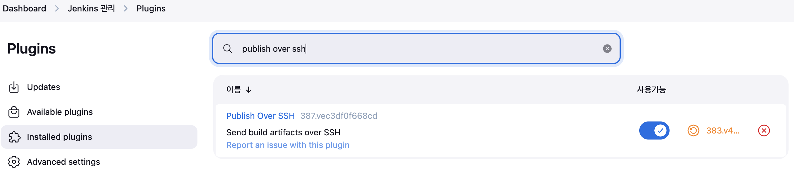
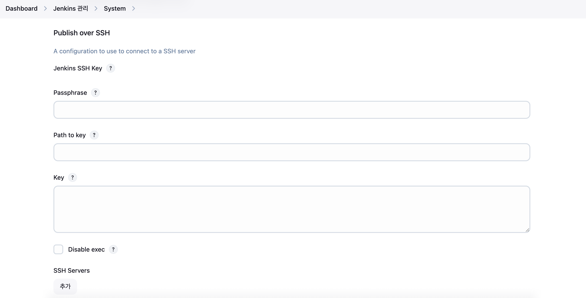
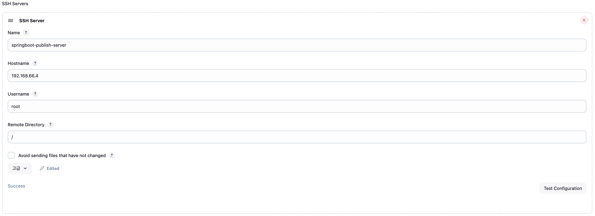
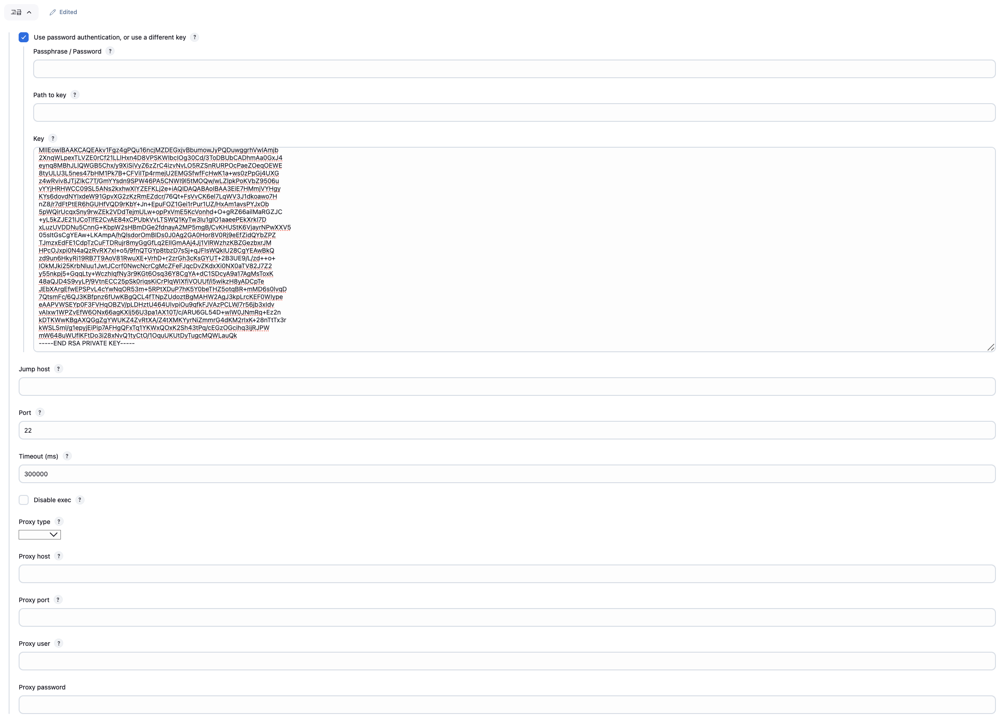
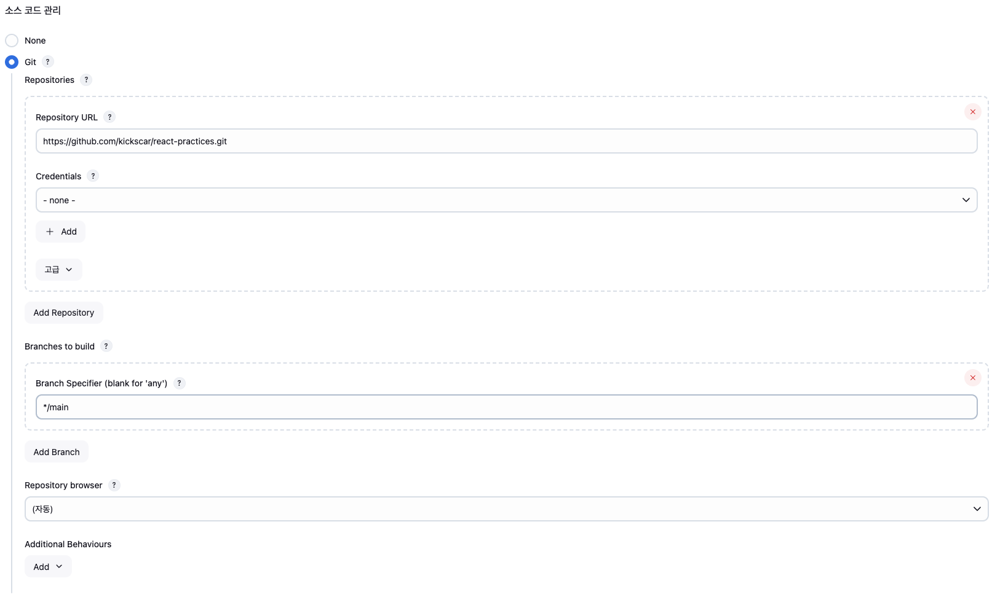
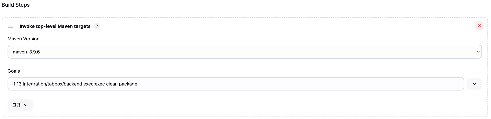
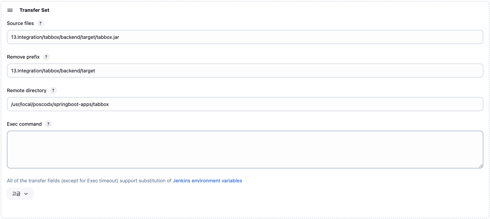
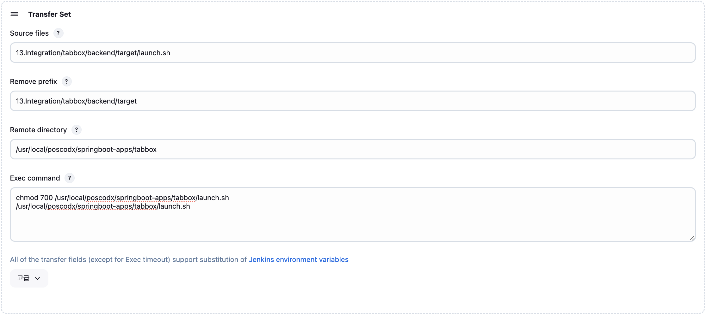

## 13. Integration - tabbox

#### Backend
1.  SpringBoot Landing Server
2.  빌드 및 실행
    ```    
    $ mvn -f tabbox/backend exec:exec clean package
    $ pwd
    $ java -Dspring.profiles.active=production -jar tabbox/backend/target/tabbox.jar 
    ```

#### Frontend
1.  빌드
    ```
    $ npm run build
    ```
 
2.  실행
    
    backend의 maven exec 플러그인이 빌드 실행


#### Deploy I: Jenkins with Publish Over SSH PlugIn

1. SSH 연결: ssh key 인증

   1)   key 생성하기
        ```
        $ ssh-keygen -t rsa -b 2048 -m PEM -C "kickscar@gmail.com" 
        ```

   2)   key 생성 확인
        - private key(개인키): ~/.ssh/id_rsa
        - public key(공개키): ~/.ssh/id_rsa.pub

   3)   공개키 설치: 서버
        ```
        $ mv ~/.ssh/id_rsa.pub ~/.ssh/authorized_keys
        ```
   
   4)   접속 환경: 서버

        ~/.ssh/environment

        ```
        PATH=/usr/local/sbin:/usr/local/bin:/usr/sbin:/usr/bin:/usr/local/poscodx/java/bin:/usr/local/poscodx/git/bin:/usr/local/poscodx/maven/bin:/usr/local/poscodx/mariadb/bin:/root/bin        
        ```
 
   5)   private key 보관(lx.key.pem): 클라이언트

   6)   접속 테스트: 클라이언트
        ```
        $ ssh -i mykey.pem root@<Server IP>
        ``` 

2. Publish Over SSH 플러그인

   1)   Publish Over SSH 플러그인 설치 

        

   2) Dashboard > Jenkins 관리 > System

        

   3) 실행서버(SSH server) 등록: springboot-publish-server

      

      

3. TabBox Project(Jenkins Item) Configuration

   1) 소스 코드 관리

      
   
   2) Build Steps

      

   3) 빌드 후 조치(post-build action): Send build artifacts over SSH
   
    - Transfer Set: tabbox.jar

      

    - Transfer Set: launch.sh

      
 